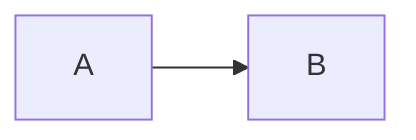

Domenico Luciani — Blog (Jekyll)
================================

This repository contains my personal blog built with Jekyll (GitHub Pages compatible). It includes a few custom UX features (code toolbar, callouts, mermaid, tag chips, human‑written badge, pretty RSS, About page with map/timeline) on top of a simple layout.

Use this document as the single place to remember how to configure, write, and publish content.

Quick Start
-----------

- Local run
  - Install Ruby + Bundler, then:
    - `bundle install`
    - `bundle exec jekyll serve`
  - Visit `http://127.0.0.1:4000/dryrun/` (respects `baseurl` in `_config.yml`).
- Create a new post
  - See the “Post Template” section for a copy‑paste front matter.
- Deploy
  - Push to the default branch on GitHub. The site is GitHub Pages compatible.

Repository Layout
-----------------

- `_posts/` — dated posts, Markdown + front matter
- `_layouts/` — page layouts (`default`, `post`, `page`)
- `_includes/` — small HTML fragments (related posts, human badge, etc.)
- `assets/` — CSS/JS/images/fonts
  - `assets/css/main.css` — global styles
  - `assets/css/about.css` — styles scoped to the About page (loaded via `extra_css`)
  - `assets/js/main.js` — anchors, code toolbar, mermaid bootstrap
  - `assets/js/about.js` — Leaflet world map for About page (loaded via `extra_js`)
  - `assets/images/` — site images (covers, posts, profile, badges)
- `feed.xml` + `assets/rss.xsl` — valid RSS with a human‑friendly browser view
- `about.md`, `now.md`, `projects.md`, … — site pages

`_config.yml` Reference
-----------------------

Top‑level
- `title` — site title
- `description` — used in `<meta>` and RSS
- `url`, `baseurl` — domain and path (for project sites). Locally the site will be at `http://127.0.0.1:4000/baseurl/`.

Author & social
- `author` — your name
- `author_avatar` — path or absolute URL to the profile image used on posts
- `links` — list of social links (label, url, rel)

Navigation
- `nav` — header links (`title`, `url`) — the active link is automatically highlighted

Writing & build
- `markdown: kramdown` — Markdown engine
- `highlighter: rouge` — code highlighter
- `kramdown.syntax_highlighter_opts.block.line_numbers` — line numbers on code blocks (can be overridden per block)
- `permalink` — pretty URL pattern for posts
- `timezone`, `paginate`, `paginate_path` — self‑explanatory
- `plugins` — GitHub Pages‑compatible plugins already enabled
- `defaults` — default front matter for posts (layout, lang, tags)
- `exclude` / `include` — build include/exclude lists

Homepage hero (optional)
- `hero.image` — URL to hero background image (local or remote)
- `hero.kicker`, `hero.title`, `hero.subtext` — texts visible on the homepage
- `hero.cta_label`, `hero.cta_url` — CTA button/link

Human badge
- `human_badge_link` — URL opened when clicking the “Written by a human, not by AI” badge (defaults to `#` if omitted). Badge assets live under `assets/images/notai/`.

About page configuration (`about.*`)
- `about.tagline` — short sentence below your name
- `about.location` — e.g., `Málaga, ES (remote)`
- `about.highlights` — bullet highlights
- `about.photos` — array of images for the photo strip. Each item can be either a string path or an object with:
  - `src` — image path
  - `alt` — alt text
  - `pos` — optional `object-position` (e.g., `50% 35%`) to fine‑tune the crop
- `about.avatar_pos` — default `object-position` for the avatar (e.g., `50% 50%`)
- `about.experience` — array of jobs (rendered as a compact timeline)
  - `org` — company; `role` — role/title
  - `from`, `to` — years (use `present` for current)
  - `url` — external link
  - `summary` — short paragraph (clamped to 2 lines in the UI)
- `about.places` — array of places for the world map (Leaflet). Each item:
  - `name`, `country` (2‑letter code), `lat`, `lon`
  - `kind` — one of: `living` (big pulsing green dot), `lived` (amber, larger than visited), `visited` (blue)

Page Front Matter Options
-------------------------

Common page fields (e.g., `about.md`, `now.md`, `projects.md`)
- `layout` — `page` or `default` (use `page` to get the page header)
- `title` — page title
- `description` — optional subtitle under the page title (used by SEO too)
- `permalink` — fixed URL (useful for top‑level pages)
- `extra_css` — list of CSS files (no extension) from `assets/css/` to load only on this page
- `cdn_css`, `cdn_js` — list of absolute URLs to load CSS/JS from CDNs (used by the About page for Leaflet)
- `extra_js` — list of JS files (no extension) from `assets/js/` to load only on this page
- `hide_progress` — set to `true` to hide the reading progress bar on that page

About page specific
- The About page (`about.md`) already sets `extra_css: [about]`, and for the map it sets `cdn_css: [leaflet.css]`, `cdn_js: [leaflet.js]`, `extra_js: [about]`.

Post Front Matter Options
-------------------------

Minimal post template

```yaml
---
layout: post
title: "Post title"
description: "Short teaser used in lists and RSS"
# Optional hero image (local or remote). You can use either field:
cover: "/assets/images/covers/example.jpg"  # or
image: "https://images.pexels.com/photos/…/pexels-photo.jpeg"
# Optional
image_alt: "Accessible alt"
image_caption: "Optional caption under the hero"
tags: [engineering]
# Publish controls
date: 2025-05-12 10:00:00   # optional; default is the date in the filename
published: true             # set to false to keep it out of the site even if pushed
# Optional discuss links
hn_url: "https://news.ycombinator.com/item?id=…"
reddit_url: "https://www.reddit.com/r/…/comments/…"
# If you update the article later
updated: 2025-05-10
---
```

Notes
- Hero image: local paths are resolved via `relative_url`. Remote Unsplash/Pexels images get automatic `srcset` for responsive loading.
- Drafts & scheduled posts:
  - You can create `_drafts/your-post.md` (no date). It won’t be published by GitHub Pages.
  - Or keep posts under `_posts/` and add `published: false` to hide them.
  - To schedule a post, set a future `date:`. GitHub Pages only publishes when the date is reached (default `future: false`).
- The post footer will show:
  - Tags (as pills)
  - Discuss links (HN/Reddit) if defined
  - Share links
  - A “Subscribe via RSS” link
  - The human‑written badge (theme‑aware, centered)
- Reading time and date are automatically computed.

Writing Features
----------------

### 1) Code blocks (Rouge)
- Use triple backticks with a language:
  ```go
  func main() { println("hi") }
  ```
- Line numbers are enabled globally. To disable them for a specific block you can wrap code in backticks without a language or set site‑wide in `_config.yml`.
- The site adds a code toolbar with:
  - Language label
  - Collapse/expand toggle
  - Copy button

### 2) Callouts
Styled admonitions via Markdown blockquotes + Kramdown attribute list:
```
> **Tip — Title**
> Body text here.
{: .callout .info}
```
Available variants: `.info`, `.warn`, `.error`, `.success`.

### 3) Headings anchors
`h2`/`h3`/`h4` get an inline link icon. Clicking a heading (or the icon) copies/scrolls to the anchored section.

### 4) Videos & iframes
YouTube/Vimeo iframes automatically get 16:9 responsive styling:
```html
<div class="video">
  <iframe src="https://www.youtube.com/embed/VIDEO_ID" allowfullscreen></iframe>
  </div>
```

### 5) Mermaid diagrams
- Use a fenced code block labelled `mermaid`:
  ```mermaid
  flowchart TD
    A --> B
  ```
- They are converted on the client and re‑rendered when switching theme (light/dark).

### 6) Images
- Place post images under `assets/images/posts/` and reference them with Liquid so `baseurl` is respected:
  ``
- The hero image accepts local or remote paths (see front matter above).

Tags System
-----------
- Post footer shows tags as pills (links to the Tags page filtered by `?t=slug`).
- `tags.md` renders a chips row (All + individual tags). Clicking a chip filters sections. `?t=slug` selects the initial tag.

Pretty RSS (Browser View)
------------------------
- `feed.xml` is a standard RSS 2.0 feed readable by any reader.
- Browsers will apply `assets/rss.xsl` and render a minimal, light‑themed list with title, date and description, plus subscription links (Feedly, Inoreader, NewsBlur, Follow, direct RSS/source).

Human‑Written Badge
-------------------
- The badge is included under every post via `_includes/human-badge.html`.
- Images live in `assets/images/notai/` and switch automatically with the theme.

About Page — Special Features
-----------------------------
- Avatar + bio area (two‑column on small screens and up).
- Photo strip (1/2/3 columns responsive). Each image supports an optional `pos` to adjust the crop.
- Experience timeline: shows all entries defined in `about.experience`.
- World map (Leaflet) of places (`about.places`).
  - `kind: living` shows a larger pulsing marker.
  - `kind: lived` shows a larger amber marker.
  - `kind: visited` shows a blue marker.
  - Panning is bounded to the world; tiles switch light/dark with the site theme.

Post Template (Copy‑Paste)
-------------------------

```markdown
---
layout: post
title: "My Post"
description: "Why it matters"
cover: "/assets/images/covers/example.jpg"  # or `image: <https url>`
image_alt: "Descriptive alt"
image_caption: "Optional caption"
tags: [engineering]
hn_url: ""
reddit_url: ""
updated: 2025-05-10
---

Intro paragraph…

> **Tip — Keep it small**
> Small callouts are nice.
{: .callout .info}

```go
package main
func main() { println("hello") }
```


```

Tips & Conventions
------------------
- Prefer local images in `assets/images/covers` and `assets/images/posts` to avoid remote breakage. For Unsplash/Pexels covers, the layout adds a responsive `srcset`.
- Use meaningful `description` for better SEO and for the RSS.
- Use 1–3 tags per post (macro tags are better than many micro‑tags).
- If a page needs custom styling/JS (e.g., About), use `extra_css`, `extra_js`, `cdn_css`, `cdn_js` in the page’s front matter.

Troubleshooting
---------------
- “Image paths broken locally” — remember to wrap paths with `{{ '…' | relative_url }}` in Markdown.
- “Mermaid renders as text after theme switch” — handled automatically; ensure the fenced block uses `mermaid`.
- “Bad badge path” — badge paths are under `assets/images/notai/`; edit `_includes/human-badge.html` if you rename them.
- Clean build: `bundle exec jekyll clean && bundle exec jekyll serve`.

License & Notes
---------------
- The source of the blog is yours. Third‑party libraries used: Leaflet (CDN) for the map and Mermaid (CDN) for diagrams. The RSS view uses a small XSLT bundled in the repo.

---
This README is intentionally thorough so you can quickly recall how to use every feature without digging through templates.
